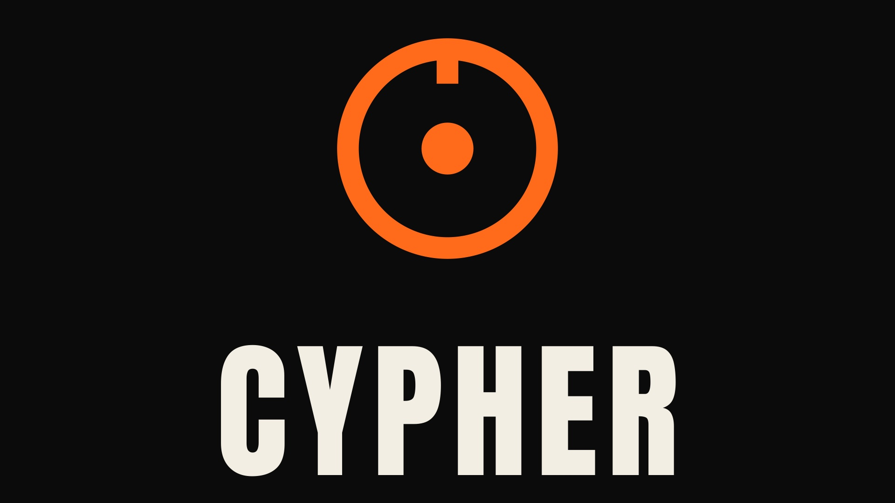
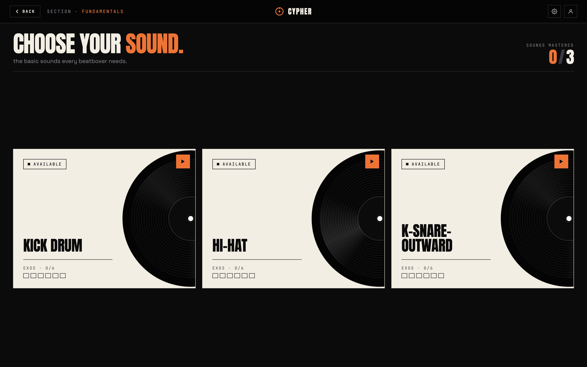
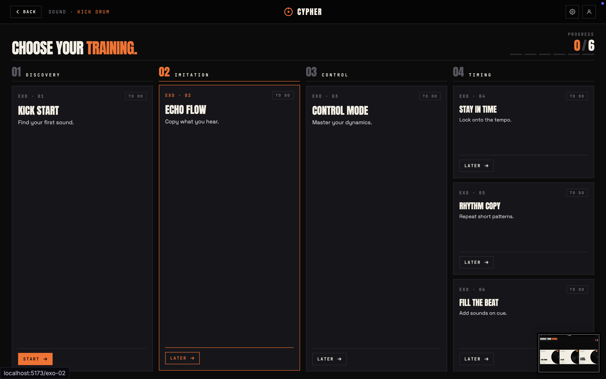
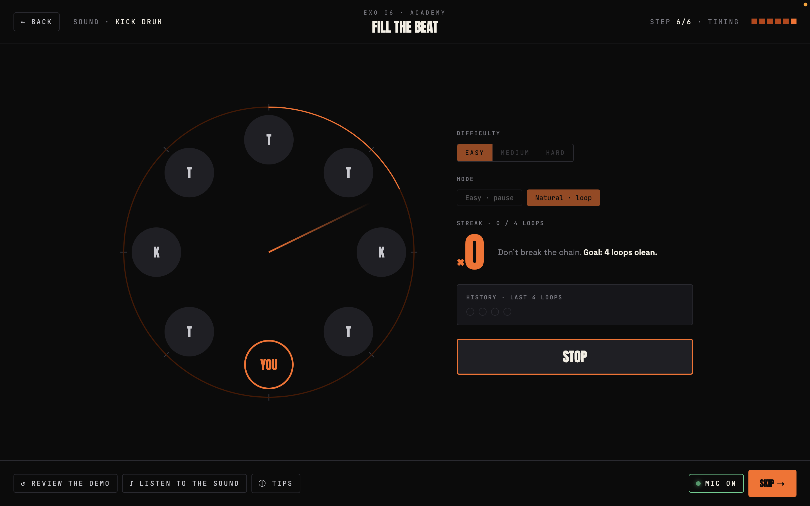

# Cypher
> Learn beatboxing like a game. An interactive academy to master the fundamental sounds, one cypher at a time.



This project was born from my thesis : **« L'IA peut-elle transformer l'art du beatbox ? »** ([read the full paper (FR, PDF)](public/memory/memory.pdf)). Cypher is the practical answer to that question: an app that uses machine learning to listen to a beatboxer and guide their learning.

Cypher breaks down each sound (kick, hi-hat, snare…) into progressive exercises: you listen to the demo, study the technique, then it's your turn to play. Sounds unlock one by one, with a visual direction inspired by GBB battles.

## Features

- Sound library with audio preview, even on locked sounds
- Video exercises split into phases (Intro, Demo, Technique, Attempts, Recap)
- Guided attempts: the video pauses, you reproduce the sound, the model evaluates it
- Gamified progression (locked / available / in progress / done)
- Vinyl transitions between screens





## Stack

- **Frontend** : Vue 3 (`<script setup>`), Vue Router, Pinia
- **Backend** : Python (audio recognition model)
- **Runtime** : Bun
- Custom design system (orange / ink / bone, grain texture)

## The Model

The heart of Cypher is a Python model that listens to the mic, compares the captured audio to the target sound, and validates your attempts in real time : telling you whether your kick actually sounds like a kick. The backend exposes this model to the frontend for live feedback during exercises.

A `model.py` script handles training and outputs a `model.joblib` file : the actual classifier the app loads. It was trained on several classes:

- The beatbox sounds themselves: **kick**, **hi-hat**, **k-snare-outward**
- **Silence**, so it doesn't react to an empty mic
- **Speech / consonants**, so it doesn't mistake talking for a beatbox sound

That last point matters: without speech samples, the model would fire false detections every time the user speaks near the mic.

You can retrain at any time : run `model.py` to generate a fresh `model.joblib`, then attach whichever model you want to the app. Each `.joblib` is basically a swappable "brain": a different training run can recognize different sounds without touching the rest of the codebase.

## Install

```sh
bun install
```

Then depending on your OS:

**Windows**
```sh
bun run server:setup:win
```

**Mac / Linux**
```sh
bun run server:setup:mac
```

## Run

In two separate terminals:

**Frontend**
```sh
bun run dev
```

**Backend**

Windows:
```sh
bun run server:win
```

Mac / Linux:
```sh
bun run server:mac
```
